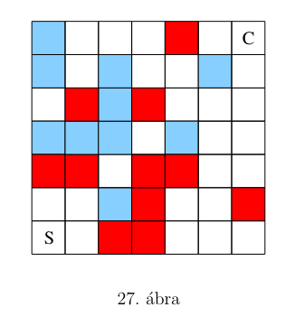

# 1.29. Feladat 

A 27. ábrán látható tábla S jelű mezőjére helyezett figurával a C jelű mezőre kell eljutni.
A figurát minden lépésben függőlegesen vagy vízszintesen lehet elmozdítani egy mezővel. 
A fehér mezőkről előre kell lépni, azaz abba az irányba, melyben a figura a megelőző lépésben lépett. 
(Az előző lépés iránya a figura haladási iránya). 
A piros mezőkről a figurával előre lehet lépni, vagy pedig a haladási irányhoz képest jobbra fordulva,
a kék mezőkről előre, vagy pedig balra fordulva. 
Az első lépést megelőzően a figura haladási iránya észak, 
tehát az induló mezőről  a figurával abba az irányba kell lépni.

## Megoldás
1. UP
1. UP
1. RIGHT
1. RIGHT
1. RIGHT
1. DOWN
1. DOWN
1. LEFT
1. UP
1. UP
1. UP
1. UP
1. UP
1. LEFT
1. LEFT
1. DOWN
1. DOWN
1. RIGHT
1. RIGHT
1. RIGHT
1. RIGHT
1. UP
1. UP
1. UP
1. RIGHT
1. RIGHT
